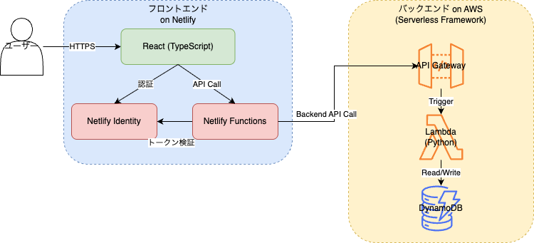

# 基本設計書

## システム構成

### システム構成図

#### バックエンド処理の役割分担

Netlify Functions と、AWS Lambda にて、バックエンド処理が可能。
上記２つは、以下の役割分担とする。

- Netlify Functions
  - フロントエンドから直接呼び出し可能
  - DB へのアクセスが不可能
  - Netlify Identity を使用して、ユーザー認証が可能。
  - **AWS Lambada から認証機能を切り離し、フロントエンドと AWS Lambda 間の中間サーバとして扱う。**
- AWS Lambda
  - DB へのアクセスが可能
  - **Netlify Functions を橋渡し役にすることで、リクエスト元の権限を気にせず、管理者権限としてバックエンド処理を実行する。**

## 画面設計

### 画面一覧

| 画面名           | 要ログイン | 説明                       |
| ---------------- | ---------- | -------------------------- |
| トップページ     | いいえ     | Discord でログインする画面 |
| マッチングページ | はい       | マッチングを開始する画面   |
| マイページ       | はい       | ユーザーのマイページ       |
| ランキングページ | いいえ     | ランキングを表示する画面   |
| 使い方ページ     | いいえ     | 使い方を説明する画面       |

要ログインページにて、未ログインでアクセスした場合、トップページにリダイレクトする。
