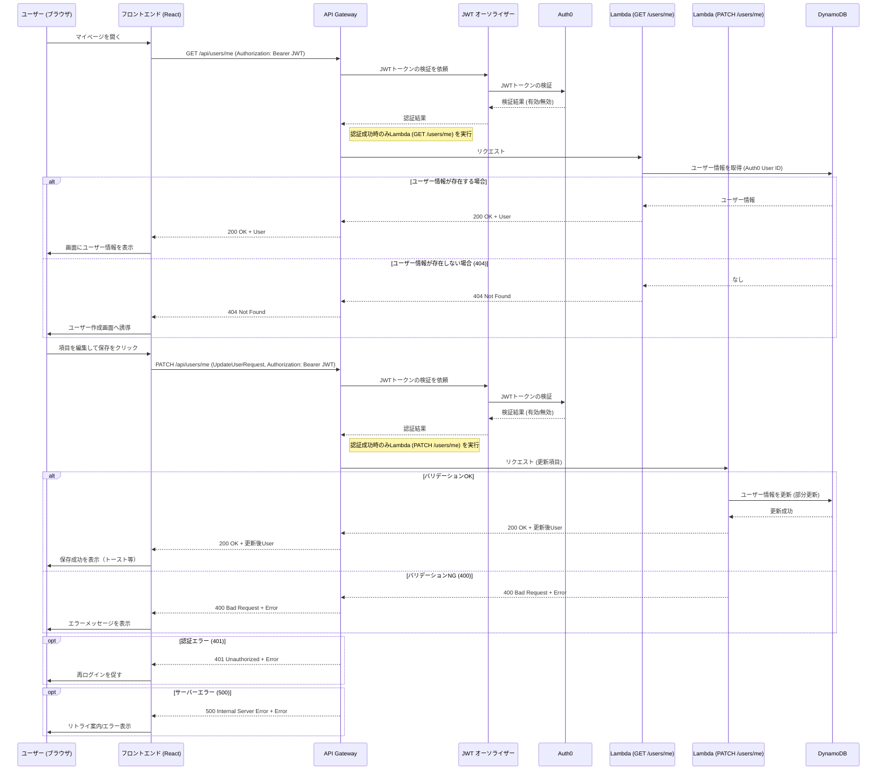

```mermaid
sequenceDiagram
    participant User as ユーザー (ブラウザ)
    participant Frontend as フロントエンド (React)
    participant APIGateway as API Gateway
    participant JWTAuth as JWT オーソライザー
    participant Auth0 as Auth0
    participant LambdaGetMe as Lambda (GET /users/me)
    participant LambdaUpdateUser as Lambda (PATCH /users/me)
    participant DynamoDB as DynamoDB

    %% 1) マイページ表示フロー
    User->>Frontend: マイページを開く
    Frontend->>APIGateway: GET /api/users/me (Authorization: Bearer JWT)
    APIGateway->>JWTAuth: JWTトークンの検証を依頼
    JWTAuth->>Auth0: JWTトークンの検証
    Auth0-->>JWTAuth: 検証結果 (有効/無効)
    JWTAuth-->>APIGateway: 認証結果
    note right of APIGateway: 認証成功時のみLambda (GET /users/me) を実行
    APIGateway->>LambdaGetMe: リクエスト
    LambdaGetMe->>DynamoDB: ユーザー情報を取得 (Auth0 User ID)

    alt ユーザー情報が存在する場合
        DynamoDB-->>LambdaGetMe: ユーザー情報
        LambdaGetMe-->>APIGateway: 200 OK + User
        APIGateway-->>Frontend: 200 OK + User
        Frontend->>User: 画面にユーザー情報を表示
    else ユーザー情報が存在しない場合 (404)
        DynamoDB-->>LambdaGetMe: なし
        LambdaGetMe-->>APIGateway: 404 Not Found
        APIGateway-->>Frontend: 404 Not Found
        Frontend->>User: ユーザー作成画面へ誘導
    end

    %% 2) マイページ更新フロー
    User->>Frontend: 項目を編集して保存をクリック
    Frontend->>APIGateway: PATCH /api/users/me (UpdateUserRequest, Authorization: Bearer JWT)
    APIGateway->>JWTAuth: JWTトークンの検証を依頼
    JWTAuth->>Auth0: JWTトークンの検証
    Auth0-->>JWTAuth: 検証結果 (有効/無効)
    JWTAuth-->>APIGateway: 認証結果
    note right of APIGateway: 認証成功時のみLambda (PATCH /users/me) を実行
    APIGateway->>LambdaUpdateUser: リクエスト (更新項目)

    alt バリデーションOK
        LambdaUpdateUser->>DynamoDB: ユーザー情報を更新 (部分更新)
        DynamoDB-->>LambdaUpdateUser: 更新成功
        LambdaUpdateUser-->>APIGateway: 200 OK + 更新後User
        APIGateway-->>Frontend: 200 OK + 更新後User
        Frontend->>User: 保存成功を表示（トースト等）
    else バリデーションNG (400)
        LambdaUpdateUser-->>APIGateway: 400 Bad Request + Error
        APIGateway-->>Frontend: 400 Bad Request + Error
        Frontend->>User: エラーメッセージを表示
    end

    opt 認証エラー (401)
        APIGateway-->>Frontend: 401 Unauthorized + Error
        Frontend->>User: 再ログインを促す
    end

    opt サーバーエラー (500)
        APIGateway-->>Frontend: 500 Internal Server Error + Error
        Frontend->>User: リトライ案内/エラー表示
    end
```

