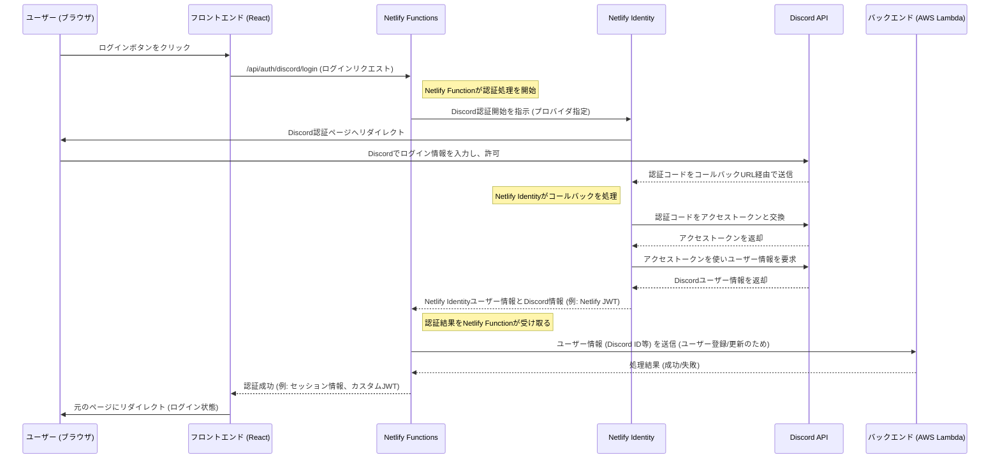

```mermaid
sequenceDiagram
    participant User as ユーザー (ブラウザ)
    participant Frontend as フロントエンド (React)
    participant NetlifyFunc as Netlify Functions
    participant NetlifyIdentity as Netlify Identity
    participant Discord as Discord API
    participant Backend as バックエンド (AWS Lambda)

    User->>Frontend: ログインボタンをクリック
    Frontend->>NetlifyFunc: /api/auth/discord/login (ログインリクエスト)
    note right of NetlifyFunc: Netlify Functionが認証処理を開始
    NetlifyFunc->>NetlifyIdentity: Discord認証開始を指示 (プロバイダ指定)
    NetlifyIdentity->>User: Discord認証ページへリダイレクト
    User->>Discord: Discordでログイン情報を入力し、許可
    Discord-->>NetlifyIdentity: 認証コードをコールバックURL経由で送信
    note left of NetlifyIdentity: Netlify Identityがコールバックを処理
    NetlifyIdentity->>Discord: 認証コードをアクセストークンと交換
    Discord-->>NetlifyIdentity: アクセストークンを返却
    NetlifyIdentity->>Discord: アクセストークンを使いユーザー情報を要求
    Discord-->>NetlifyIdentity: Discordユーザー情報を返却
    NetlifyIdentity-->>NetlifyFunc: Netlify Identityユーザー情報とDiscord情報 (例: Netlify JWT)
    note right of NetlifyFunc: 認証結果をNetlify Functionが受け取る
    NetlifyFunc->>Backend: ユーザー情報 (Discord ID等) を送信 (ユーザー登録/更新のため)
    Backend-->>NetlifyFunc: 処理結果 (成功/失敗)
    NetlifyFunc-->>Frontend: 認証成功 (例: セッション情報、カスタムJWT)
    Frontend->>User: 元のページにリダイレクト (ログイン状態)
```
