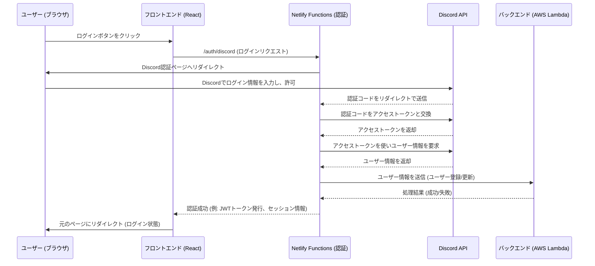

```mermaid
sequenceDiagram
    participant User as ユーザー (ブラウザ)
    participant Frontend as フロントエンド (React)
    participant NetlifyFunc as Netlify Functions (認証)
    participant Discord as Discord API
    participant Backend as バックエンド (AWS Lambda)

    User->>Frontend: ログインボタンをクリック
    Frontend->>NetlifyFunc: /auth/discord (ログインリクエスト)
    NetlifyFunc->>User: Discord認証ページへリダイレクト
    User->>Discord: Discordでログイン情報を入力し、許可
    Discord-->>NetlifyFunc: 認証コードをリダイレクトで送信
    NetlifyFunc->>Discord: 認証コードをアクセストークンと交換
    Discord-->>NetlifyFunc: アクセストークンを返却
    NetlifyFunc->>Discord: アクセストークンを使いユーザー情報を要求
    Discord-->>NetlifyFunc: ユーザー情報を返却
    NetlifyFunc->>Backend: ユーザー情報を送信 (ユーザー登録/更新)
    Backend-->>NetlifyFunc: 処理結果 (成功/失敗)
    NetlifyFunc-->>Frontend: 認証成功 (例: JWTトークン発行、セッション情報)
    Frontend->>User: 元のページにリダイレクト (ログイン状態)
```
