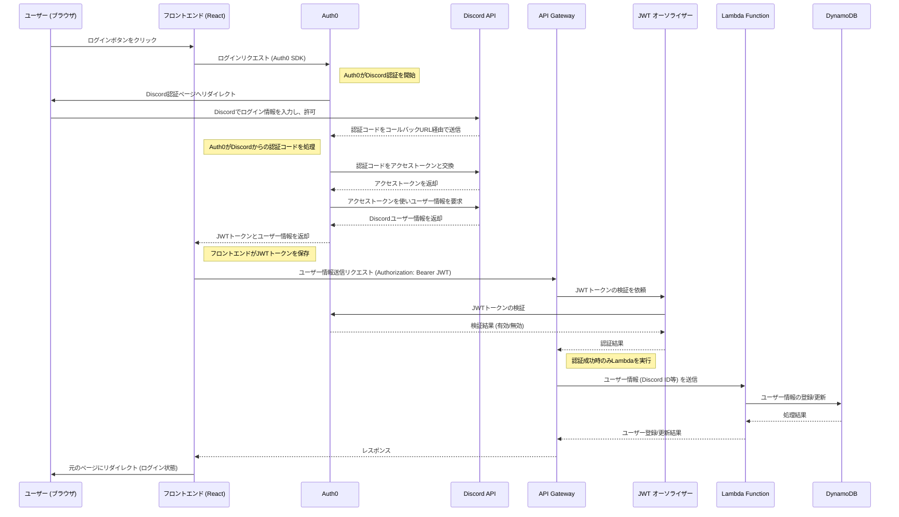

```mermaid
sequenceDiagram
    participant User as ユーザー (ブラウザ)
    participant Frontend as フロントエンド (React)
    participant Auth0 as Auth0
    participant Discord as Discord API
    participant APIGateway as API Gateway
    participant JWTAuth as JWT オーソライザー
    participant Lambda as Lambda Function
    participant DynamoDB as DynamoDB

    User->>Frontend: ログインボタンをクリック
    Frontend->>Auth0: ログインリクエスト (Auth0 SDK)
    note right of Auth0: Auth0がDiscord認証を開始
    Auth0->>User: Discord認証ページへリダイレクト
    User->>Discord: Discordでログイン情報を入力し、許可
    Discord-->>Auth0: 認証コードをコールバックURL経由で送信
    note left of Auth0: Auth0がDiscordからの認証コードを処理
    Auth0->>Discord: 認証コードをアクセストークンと交換
    Discord-->>Auth0: アクセストークンを返却
    Auth0->>Discord: アクセストークンを使いユーザー情報を要求
    Discord-->>Auth0: Discordユーザー情報を返却
    Auth0-->>Frontend: JWTトークンとユーザー情報を返却
    note right of Frontend: フロントエンドがJWTトークンを保存

    Frontend->>APIGateway: ユーザー情報送信リクエスト (Authorization: Bearer JWT)
    APIGateway->>JWTAuth: JWTトークンの検証を依頼
    JWTAuth->>Auth0: JWTトークンの検証
    Auth0-->>JWTAuth: 検証結果 (有効/無効)
    JWTAuth-->>APIGateway: 認証結果
    note right of APIGateway: 認証成功時のみLambdaを実行
    APIGateway->>Lambda: ユーザー情報 (Discord ID等) を送信
    Lambda->>DynamoDB: ユーザー情報の登録/更新
    DynamoDB-->>Lambda: 処理結果
    Lambda-->>APIGateway: ユーザー登録/更新結果
    APIGateway-->>Frontend: レスポンス
    Frontend->>User: 元のページにリダイレクト (ログイン状態)
```
