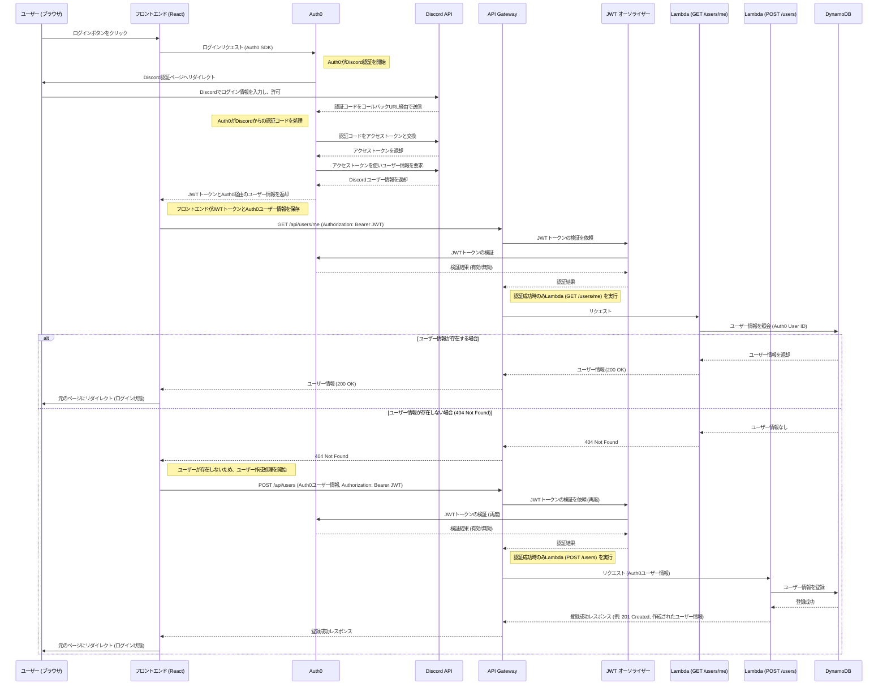

```mermaid
sequenceDiagram
    participant User as ユーザー (ブラウザ)
    participant Frontend as フロントエンド (React)
    participant Auth0 as Auth0
    participant Discord as Discord API
    participant APIGateway as API Gateway
    participant JWTAuth as JWT オーソライザー
    participant LambdaGetMe as Lambda (GET /users/me)
    participant LambdaCreateUser as Lambda (POST /users)
    participant DynamoDB as DynamoDB

    User->>Frontend: ログインボタンをクリック
    Frontend->>Auth0: ログインリクエスト (Auth0 SDK)
    note right of Auth0: Auth0がDiscord認証を開始
    Auth0->>User: Discord認証ページへリダイレクト
    User->>Discord: Discordでログイン情報を入力し、許可
    Discord-->>Auth0: 認証コードをコールバックURL経由で送信
    note left of Auth0: Auth0がDiscordからの認証コードを処理
    Auth0->>Discord: 認証コードをアクセストークンと交換
    Discord-->>Auth0: アクセストークンを返却
    Auth0->>Discord: アクセストークンを使いユーザー情報を要求
    Discord-->>Auth0: Discordユーザー情報を返却
    Auth0-->>Frontend: JWTトークンとAuth0経由のユーザー情報を返却
    note right of Frontend: フロントエンドがJWTトークンとAuth0ユーザー情報を保存

    Frontend->>APIGateway: GET /api/users/me (Authorization: Bearer JWT)
    APIGateway->>JWTAuth: JWTトークンの検証を依頼
    JWTAuth->>Auth0: JWTトークンの検証
    Auth0-->>JWTAuth: 検証結果 (有効/無効)
    JWTAuth-->>APIGateway: 認証結果
    note right of APIGateway: 認証成功時のみLambda (GET /users/me) を実行
    APIGateway->>LambdaGetMe: リクエスト
    LambdaGetMe->>DynamoDB: ユーザー情報を照会 (Auth0 User ID)

    alt ユーザー情報が存在する場合
        DynamoDB-->>LambdaGetMe: ユーザー情報を返却
        LambdaGetMe-->>APIGateway: ユーザー情報 (200 OK)
        APIGateway-->>Frontend: ユーザー情報 (200 OK)
        Frontend->>User: 元のページにリダイレクト (ログイン状態)
    else ユーザー情報が存在しない場合 (404 Not Found)
        DynamoDB-->>LambdaGetMe: ユーザー情報なし
        LambdaGetMe-->>APIGateway: 404 Not Found
        APIGateway-->>Frontend: 404 Not Found

        note right of Frontend: ユーザーが存在しないため、ユーザー作成処理を開始
        Frontend->>APIGateway: POST /api/users (Auth0ユーザー情報, Authorization: Bearer JWT)
        APIGateway->>JWTAuth: JWTトークンの検証を依頼 (再度)
        JWTAuth->>Auth0: JWTトークンの検証 (再度)
        Auth0-->>JWTAuth: 検証結果 (有効/無効)
        JWTAuth-->>APIGateway: 認証結果
        note right of APIGateway: 認証成功時のみLambda (POST /users) を実行
        APIGateway->>LambdaCreateUser: リクエスト (Auth0ユーザー情報)
        LambdaCreateUser->>DynamoDB: ユーザー情報を登録
        DynamoDB-->>LambdaCreateUser: 登録成功
        LambdaCreateUser-->>APIGateway: 登録成功レスポンス (例: 201 Created, 作成されたユーザー情報)
        APIGateway-->>Frontend: 登録成功レスポンス
        Frontend->>User: 元のページにリダイレクト (ログイン状態)
    end
```
